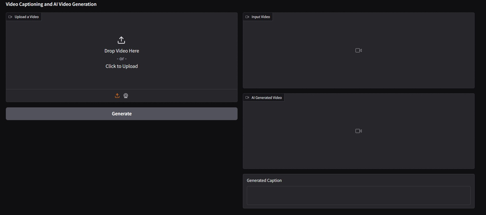
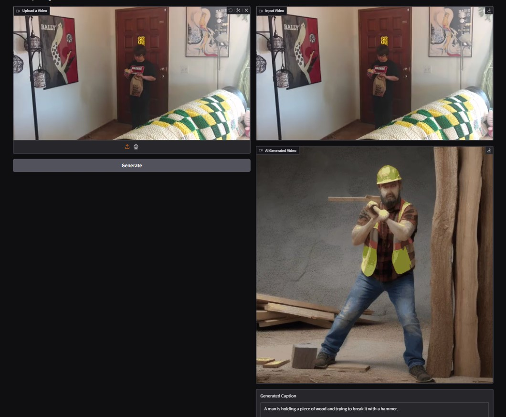

# NVIDIA_TRACK1A_TEAM12_AI054_AI037

Problem Statement: Generate rare-human actions with AI Video Generator

# Models:
[Text-to-Video Generation with AnimateDiff](https://huggingface.co/docs/diffusers/api/pipelines/animatediff#text-to-video-generation-with-animatediff)

# Steps:

- Import required libraries 
- Load video captioning and AI video generation models.

- Define a function to extract video frames and generate captions.

- Define a function to generate AI videos based on captions.

- Create a function to process input video, generate captions, and AI videos.

- Build a Gradio interface for video upload, caption display, and AI video generation.
- Launch the Gradio app for user interaction.

# Interface Using Gradio:

# Output :

# Team Members:

- [Dhanush Pujari](https://github.com/dhanu31003/NVIDA_TRACK-A_Team18.git)
